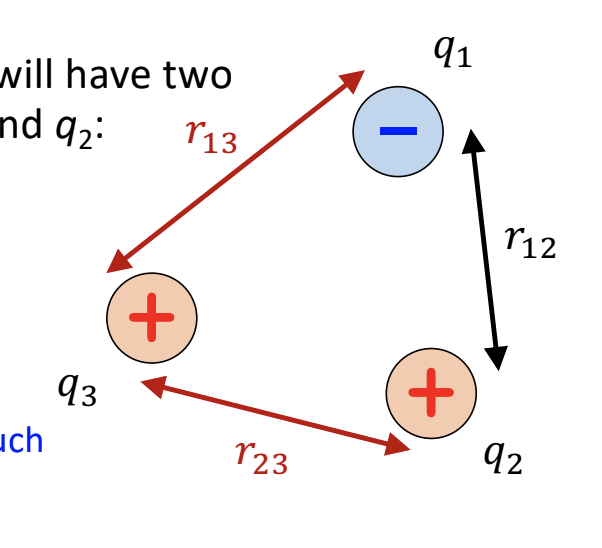

# Note_05

## Electrostatic potential energy of two charges

$U = k\frac{q_1q_2}{r_{12}}$

* It is a scalar and is **positive** when q1 and q2 repel, negative when q1 and q2 attract

## Electrostatic potential energy of three charges

(1) Calculate total energy twice

* The total energy to assemble all charges, $U_{123}$, will have two extra terms, because q3 interacts with both q1 and q2:

$U_{123} = k\frac{q_1q_2}{r_{12}}+ k\frac{q_1q_3}{r_{13}}+k\frac{q_2q_3}{r_{23}}$

adding q3 took this much additional energy:

$\Delta{U_3}=(k\frac{q_1}{r_{13}}+k\frac{q_2}{r_{23}})q_3$

(2)

Use potential V and U = qV

## Electric potential (V)

Basically the same thing as above.