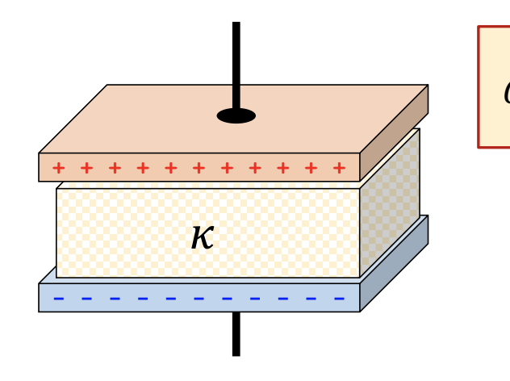
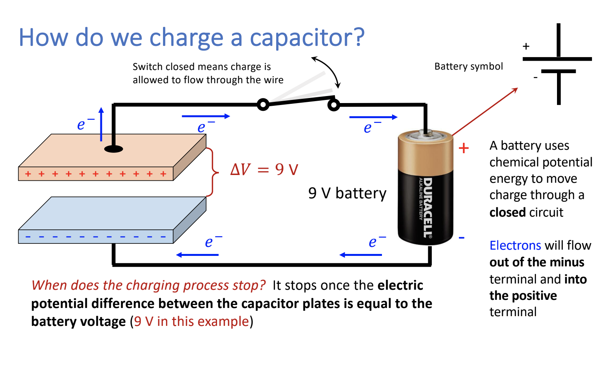

# Note_08

## Capacitors

* an electric circuit component that can store electric charge (and energy)
* This is not the same as battery

"Capacitance" C describes how much charge can be stored on the plates.

$C = \frac{Q}{\Delta V}$ or $Q = C\Delta V$

## Capacitance of a parallel-plate capacitor

$C = \kappa \frac{\varepsilon_0A}{d}$

where $\varepsilon_0$ = permittivity of free space

A = area of each plate

$\kappa$ = the dielectric constant

d = distance between the plates

* inserting a dielectric material weakens the effective E-field intensity between the plates, resulting in a larger capacitance! (Meaning kappa goes up or E goes down)

$E = \frac{\Delta V}{d} = \frac{Q}{Cd} = \frac{Q}{\kappa \varepsilon_0A}$

## Does $\Delta V$ change?

You have a capacitor that is charged by applying a potential difference $\Delta V$ across the plates. After charging, the voltage source is disconnected from the capacitor. Does $\Delta V$ change when the plates are pulled further apart?

- YES
- Q does not change, if d increases, the capacitance C decreases, therefore, change in voltage increases

### Charging a Capacitor

Energy stored in a capacitor: $U = \frac{1}{2}C(\Delta V)^2 = \frac{1}{2}Q\Delta V = \frac{Q^2}{2C}$

