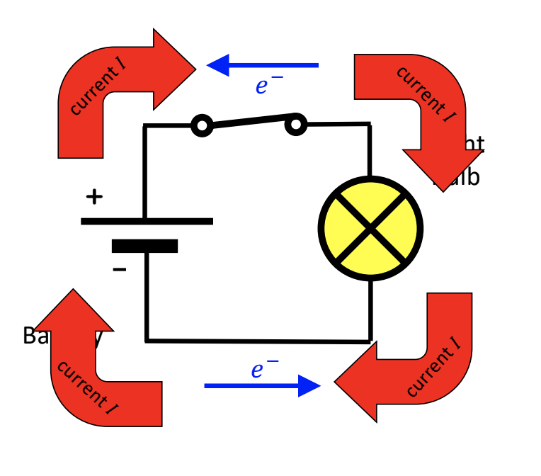

# Note_11

* Light bulb is glowing because of flow of charges = the current, I
* $I = \frac{\Delta Q}{\Delta t}$ is the amount of charge that flows per second

# Direction of current flow

The electric current in metal wires flows in the same direction as the positive charges “would” move. Equivalent as saying:

Yes, that means:

The conventional current is defined to be in the opposite direction as the flow of electrons!

## A light bulb has resistance

* The light bulb resists the flow of electrons and then glows
* For the same $\Delta V$, fewer electrons move through the circult when the light bulb is ther.

## Resistor

- Something with resistance, R

## Ohm's Law

$\Delta V = IR$

- For the same potential difference, an object with more resistance will let fewer charges through per time (i.e., less current)!

## Resitivity $\rho$

$R = \frac{\rho L}{A}$

- conductors have a very low resitivity, and insulators a very high resitivity

## Electric Power

$P = I\Delta V = I^2R = (\Delta V)^2/R$ 

