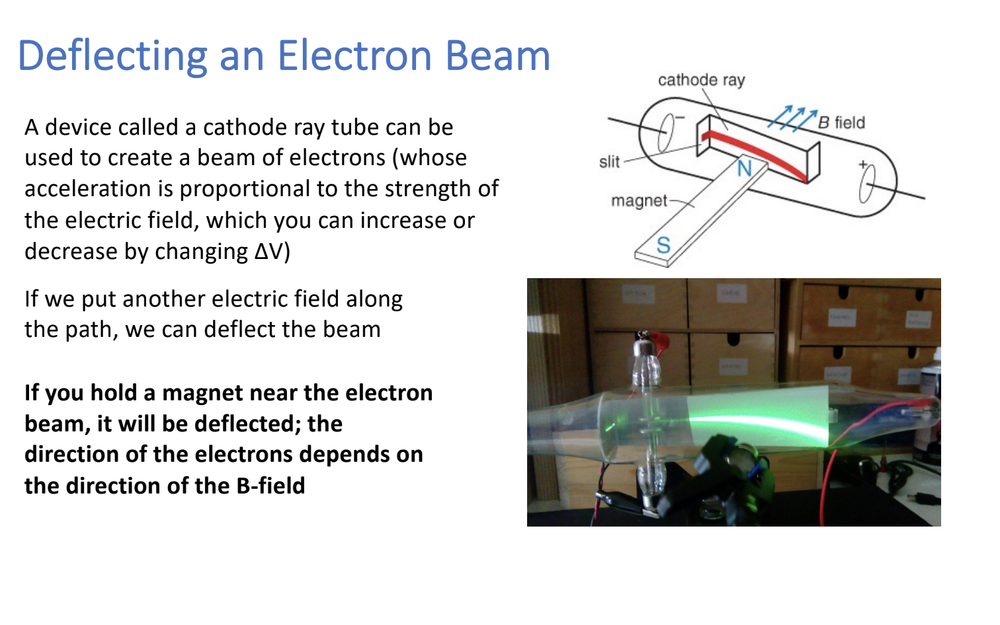
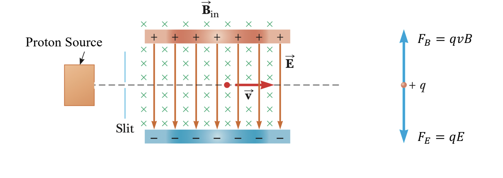

# Note_14

## Magnetic field lines

* Magnets have magnetic field lines
* Magnetic field is indicated with $\vec{B}$

## Magnetic force - magnitude & direction

* Just like $\vec{F}_E = q\vec{E}$, this equation indicates magnitude & direction: $\vec{F}_B = q\vec{v} *\vec{B}$
* Magnitude: $\abs{\vec{F}_B} = qvBsin\theta$

## Electric charge in a Magnetic Field

1. What happens when I place a positive electric charge in a magnetic field?

NOTHING! There is no force on the charge due to the magnetic field. 

2. What is the force on a positive charge with a velocity moving parallel to the field, in either direction?

ZERO

3. What is the force on a positive charge with a velocity moving at an angle $\theta$ releative to the field?

$\abs{\vec{F}_B} = qvBsin\theta$

The magnitude of the force is maximal for $\theta = 90$

## Deflecting an Electron Beam

## What happens if we have both, E-field and B-field?

1. If you shoot protons through an E-field (through a parallel plate capacitor) the E-field will deflect the protons ($F_E = qE$)
2. At the same time, you could hold a magnet near the parallel plate capacitor and use the B-field to deflect the protons in the opposite direction
3. If the electric and magnetic forces are equal, the proton will travel straight

If the electric and magnetic forces on the charge are equal, the proton will continue to travel in a straight line:

$F_E = F_B $

$qE = qvB$

$v = \frac{E}{B}$

If you change the strengths of E and B, you can choose to allow protons with particular v to pass through your device

## Direction of the magnetic Force on a Charge

To move counter-clockwise in a circle of radius R, you need:

* constant speed v going forward
* net force $\sum{F}$ pointing left
* $\sum{F} = ma_c = \frac{mv^2}{R}$
* Because the magnetic force is perpendicular to v, charged particles often move in circular paths

## Charge moving in a uniform magnetic field

A force perpendicular to the velocity, such as the magnetic force, **cannot change a charge's speed(or kinetic energy)**. All it can do is make the object change direction.

At each point the magnetic force is $F = qvB$, so $F = ma_c$ gives us:

$qvB = m \frac{v^2}{R}$ -> $R = \frac{mv}{qB}$

## Mass Spectrometer

A mass spectrometer is a device that can separate molecules and ions (atoms) based on their mass.

It begins with a source of ionized material -> positively charged.

**The ions that make it into the far-right region all have the same velocity and move through the same B-field**