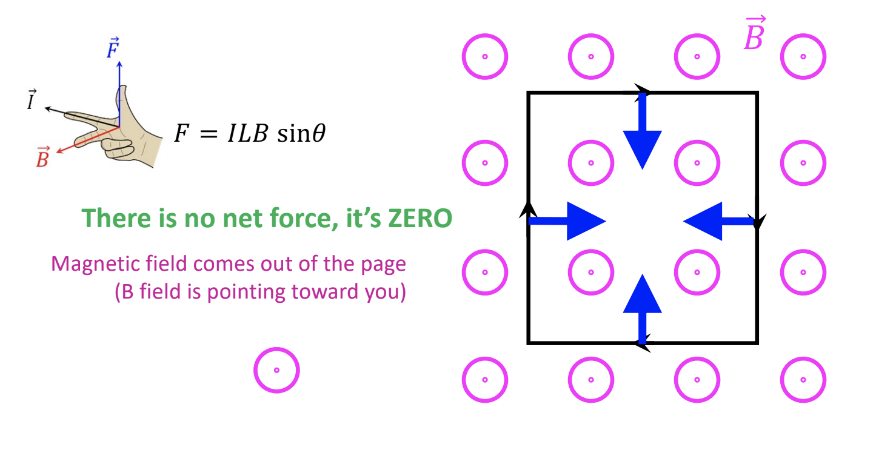
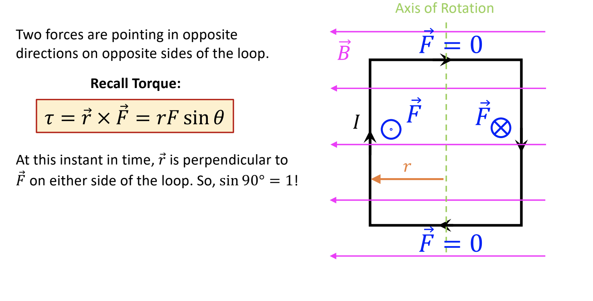

# Note_16

## Current-carrying wire

Current = flow of positive charges

## Force on current-carrying wire

$F_B = qvBsin\theta = q \frac{L}{\Delta t}Bsin\theta = \frac{q}{\Delta t}LBsin\theta = ILBsin\theta$

## Rectangular loop of current

## Another loop with current (B field going left)

In what direction is the force? ZERO

There is no net force, it's ZERO, **but there is a torque!**

## Torque on a current loop

Two force are pointing in opposite directions on opposite sides of the loop.

$\tau = \vec{r}\cross \vec{F} = rFsin\theta$

## Long straight wire with current: Oersted's Law

An electric current creates a magnetic field around it !!!

* magnetic field linew "encircle" the current-carrying wire and lie in a plane perpendicular to wire
* Reversing direction of the current -> reversed direction magnetic field
* Strength of B field is directly proportional to magnitude of current I
* Strength of B field at any point is inversely proportional to the distance of the point from wire r

