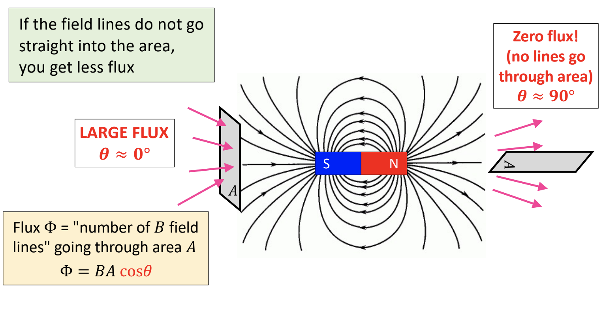

# Note_18

## Magnetic Flux

* Different meaning in physics than biology
* But in general, **indicates flow of somethign through an area**

$\Phi = BA cos\theta$

1. Larger flux when B larger
2. Larger flux when A larger

## Angle $\theta$ between B field and area A

If the field lines do not go straight into the area, you get less flux

We assign direction to a flat area. The normal vector $\vec A$ is always perpendicular to area.

## Can Magnetic Flux be negative?

Yes. If the angle between the normal vector $\vec A$ and the magnetic field $\vec B$ is between 90 and 270.

Another clever way to increase magnetic flux - multiple loops

## Faraday's Law of Induction

* You can create an emf (voltage) in a conducting loop, simply by moving a magnet... If you complete the circuit, there's a current

A changing magnetic flux will generate a voltage (emf)

 $\varepsilon = -N\frac{d\phi}{dt}$ or  $\varepsilon = -N\frac{\Delta \Phi}{\Delta t}$

