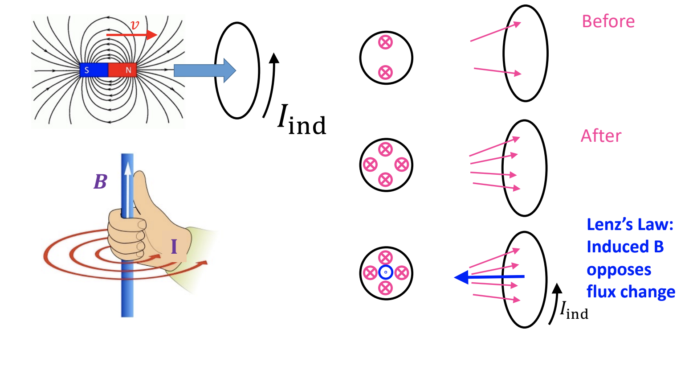

# Note_19

## Lenz's Law

If we can induce a voltage in the loop, then we can generate a current if we complete the cirucit:

$ V = IR$ -> $I_{ind} = |E|/R$

### Lenz's Law in simple terms:

"The induced current tries to cancel the change in flux"

"A changing magnetic flux induces an emf that produces a current which sets up a magnetic field that tends to oppose whatever produced the change"

$\varepsilon = -N\frac{\Delta \Phi_B}{\Delta t}$

### Right hand rule #2: the "curl" rule

Use your right hand with "the curl rule" to find the direction of the current !

* Use this rule when one thing goes in a circle, and another thing sticks out perpendicular
* Curve fingers of your right to make circle
* Thumb = direction of perpendicular thing
* In this case: **B-field is thumb, current is fingers**

