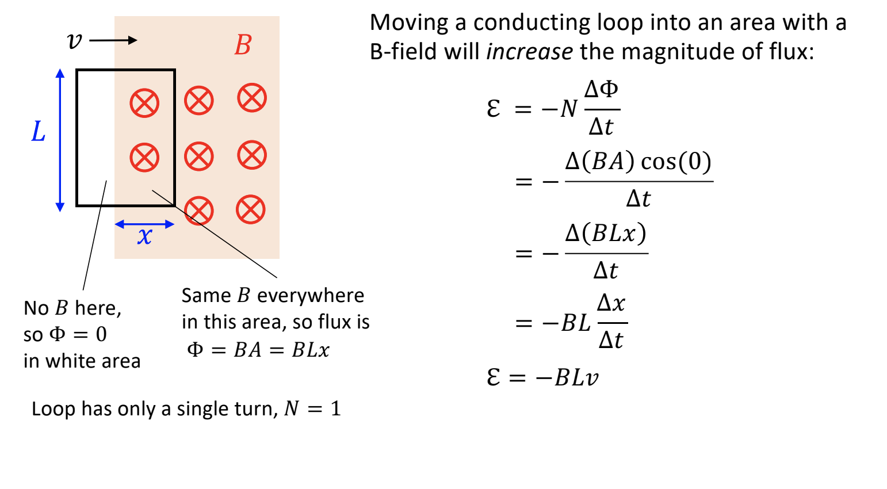
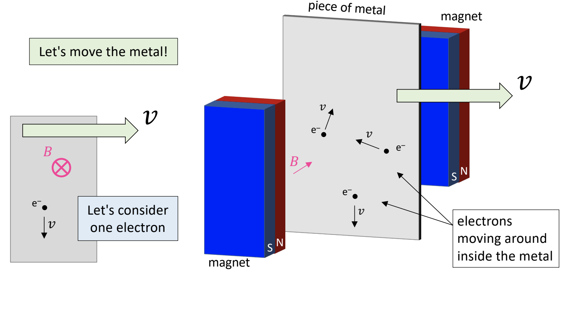
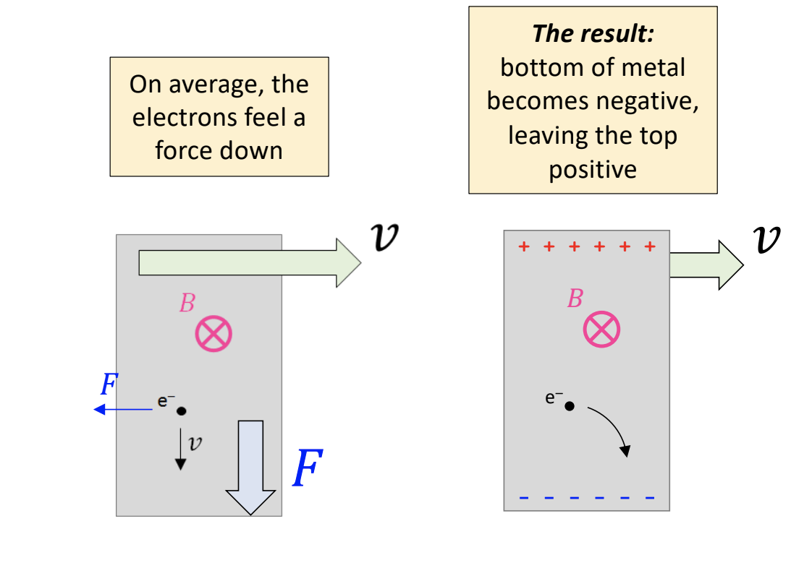
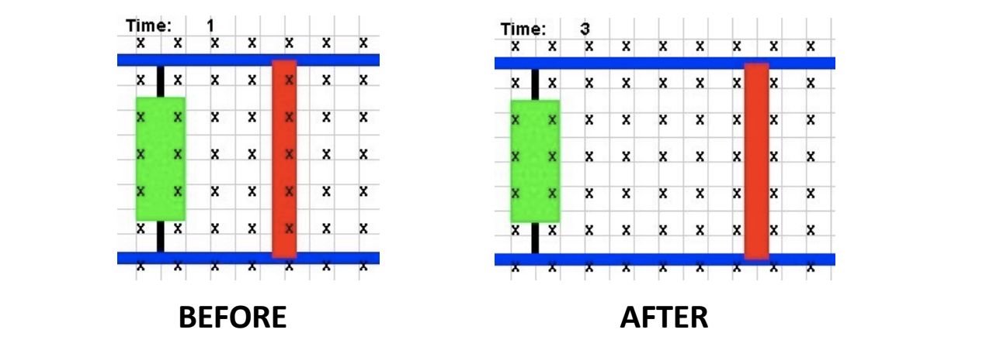

# Note_21

## Moving a loop in or out a magnetic field

Moving a conducting loop into an area with a B-field will increase the magnitude of flux:

## Motional emf: Now let's move the metal

Electron has negative charge, so opposite direction for force determined from the right hand rule. As a result:

So this is like a battery! We are generating a voltage (emf)

## Motinal emf

* How much voltage is created?
* Electrons keep moving down until their net force becomes zero:
  * $F_E = F_M$ -> $qE = qvB$
* Estimate E field with $E = |\Delta V|/d = |\varepsilon|/L$ of parallel plate capacitor, then:
  * $|\varepsilon|/L = vB$
  * $|\varepsilon| = BLv$

The simulation draws the Before and After pictures for us. To oppose the change, the loop needs to create field lines out of the page, requiring a counterclockwise induced current.