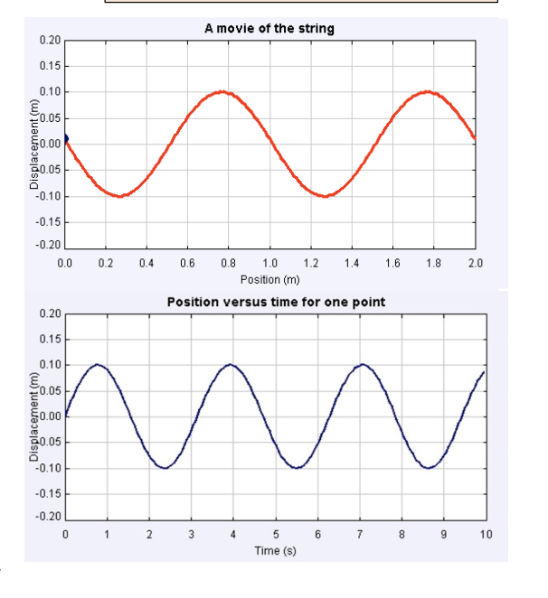

# Note_22

In transverse waves, "particles" move perpendicular to the wave direction

## How can we describe a wave?

The wave is changing in time and in space. How can we describe this complex motion?

## The Wave Equation

$y(x,t) = A sin(wt\pm kx)$

* A sine function of time, t going up and down in time
* Also, a sine function of space, x left and right through space

### Amplitude A of the wave

A = amplitude (m)

- maximum y that a point on the string can reach

### Wavelength $\lambda$ and wavenumber k

The "size" of the wave is indicated by the wavelength $\lambda$ 

But you can also use the wavenumber k

$k = \text{wavenumber} = \frac{2\pi}{\lambda}$ [rad/m]

### Frequency $f$ of the wave

How fast a point x moves up and down is indicated by the frequency $f$ or the angular frequency $w$ or the period $T$.

Period T = time needed from top -> bottom -> top

$f = \frac{1}{T}$

$w = 2\pi f$

$w = \frac{2\pi}{T}$

## Translational direction of the wave

* Sign between terms tells you the direction
  * (+) for going left
  * (-) for going right

## Two Graphs

* Wavelength can be determined by displacement vs position graph
* Period can be determined by displacement vs time graph
* Maximum speed of a single point can be determined by displacement vs time graph
  * $v_{max} = Aw = A(2\pi f) = A(\frac{2\pi}{T})$
  * $a_{max} = Aw^2$
* Speed of the wave moving in the x-direction can be determined by using both graphs
  * $v = f\lambda$

