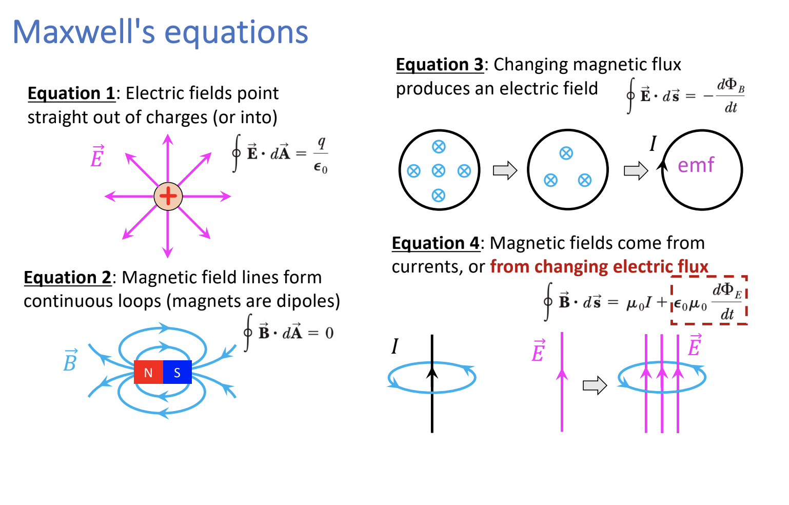
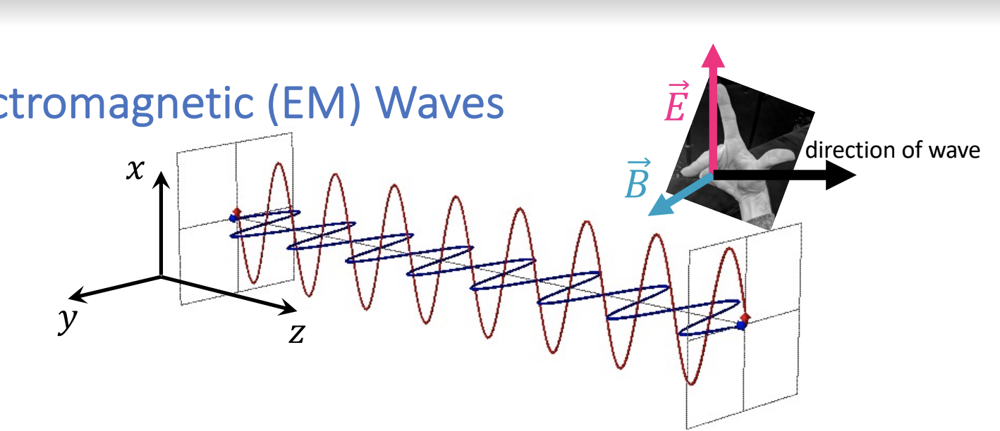
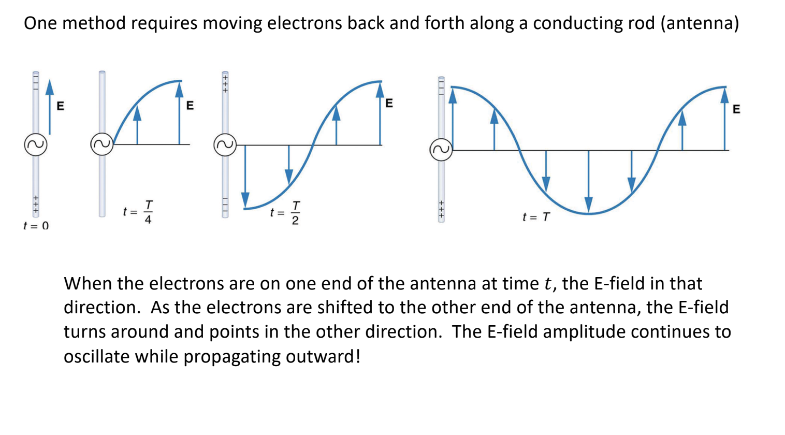
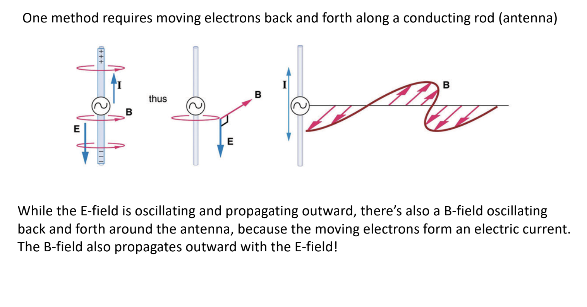

# Note_27

## Maxwell's equations

## Electromagnetic Waves

$E(x,t) = E_{max}cos(kx-wt)$

$B(x,t) = B_{max}cos(kx-wt)$

* Notice how the E-field vector is oscillating up and down on the x-axis and the B-field vector is oscillating left to right on the y-axis
* EM waves do not need a medium, unlike sound or waves on a string
* The electric and magnetic fields are also related to speed of light:
  * $v = c = \frac{E}{B}$
* Increasing frequency, decreasing wavelength, increasing energy

## How do you make an EM Wave?

* One method requires moving electrons back and forth along a conducting rod

## Energy and Intensity

